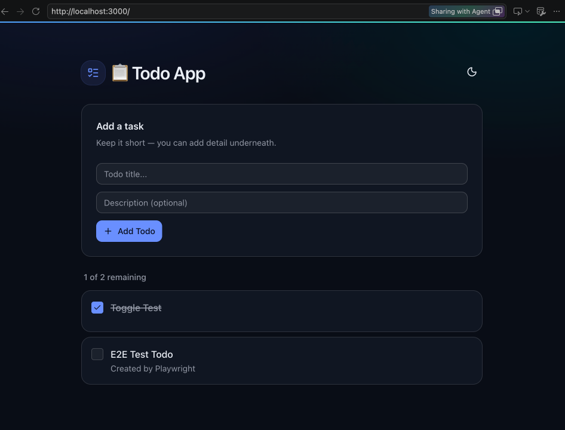
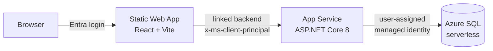

# GH-600 Lab — Preparation Guide

**Read this before Exercise 1.** Everything here is one-time setup in *your* Azure tenant and
*your* GitHub repository. None of it is part of the lab content itself — it is the foundation
that lets the initial pipeline provision the sample application so you have something real to
point agents at.

You will need a **Microsoft Entra ID tenant** and an **Azure subscription** attached to it. The
lab provisions live Azure resources and signs real users in against your directory, so neither
can be substituted or simulated. See [Prerequisites](#2-prerequisites) for the specific
permissions required in each.

Budget roughly 30 minutes. You do this once.

---

## 1. What the lab is

The lab centres on a small but complete Todo application in the
[`gh-600-lab-starter`](https://github.com/sameeraman/gh-600-lab-starter) repository:

```
gh-600-lab-starter/     ← your fork becomes the working repository
├── src/api/        ASP.NET Core 8 Web API — EF Core, Azure SQL
├── src/frontend/   React + Vite single-page app
├── infra/          Azure Bicep — the whole environment
└── .github/        Workflows, and the agent configuration you build
```

The starter is an assumed **GH-500 baseline**: application source, Bicep infrastructure,
conventional CI/CD, CodeQL analysis, dependency review, and secret scanning are already present.
This GH-600 lab does not teach those controls again. Instead, you fork that baseline and focus on
turning its conventional pipeline into an agentic one. Section 4 sets up your fork.

The application front end looks like below when it's working. 


Over eight exercises you transform the single conventional pipeline that ships with it into an
agentic CI/CD system: custom agents with graduated tool permissions, MCP servers, parallel
multi-agent review, pre-tool policy hooks, and deployment gates. The exercises are about the
*pipeline*, not the application — the application exists so the agents have genuine code,
genuine tests, and a genuine deployment to reason about.

That only works if the application actually runs. Hence this guide.

### Architecture



Three things about this shape matter later, when you are debugging agent output:

- **The frontend never calls the API directly.** Static Web Apps *linked backends* proxy
  `/api/*` to the App Service and inject the signed-in user as an `x-ms-client-principal`
  header. Easy Auth on the App Service validates that header and strips any inbound forgery.
- **There are no database passwords anywhere.** The API authenticates to Azure SQL with a
  user-assigned managed identity. The SQL server is configured for Entra-only authentication.
- **There are no cloud credentials in GitHub.** The pipeline authenticates to Azure with OIDC
  federation, so no client secret is ever stored or rotated.

### How it gets deployed

`.github/workflows/ci.yml` builds and tests on every pull request. On a push to `main` it also
runs a `deploy` job:

```
Azure login (OIDC)
  └── Deploy infrastructure (Bicep)          ← creates identity, App Service, SQL, SWA
        └── Grant managed identity SQL access ← creates the contained DB user
              └── Publish + deploy API
                    └── Build + deploy frontend
```

The Bicep template is the source of truth for everything ARM can express. The one step it
*cannot* cover is creating a database user, because that is a data-plane operation — so the
pipeline does it, reading the identity's client ID straight out of the Bicep outputs. This is
why you must deploy through the pipeline rather than running `az deployment group create` by
hand.

### What this guide covers

Only the foundational pieces the pipeline cannot create for itself:

| # | Item | Why the pipeline can't do it |
|---|------|------------------------------|
| 1 | Fork of the starter repository | Gives each learner an independent copy of the baseline workflow |
| 2 | Resource group | The deployment targets it; it must pre-exist |
| 3 | Deploy app registration + service principal | It *is* the pipeline's identity |
| 4 | Federated credentials | Establishes the OIDC trust that lets the pipeline log in |
| 5 | Contributor role assignment | Grants the pipeline permission to deploy |
| 6 | API app registration | Entra objects live outside the resource group |
| 7 | Resource provider registration | Subscription-level, not resource-level |
| 8 | GitHub secrets and variables | Consumed by the workflow, so must exist first |

---

## 2. Prerequisites

**Accounts — you cannot start without these**

| Requirement | Why |
|-------------|-----|
| A **Microsoft Entra ID tenant** you can create app registrations in | The pipeline's identity, the OIDC federation, and the API's audience are all Entra objects. The application also signs users in against this tenant |
| An **Azure subscription** linked to that tenant, with quota to create resources | Every resource in the architecture diagram is provisioned into it |
| A **GitHub account** that can fork a public repository | You fork the starter in section 4. The pipeline and OIDC trust belong to that specific fork |
| An active **GitHub Copilot plan with Copilot CLI access** for the account that owns the fork | The agent-review jobs invoke Copilot CLI in GitHub Actions. Copilot Free is sufficient for the lab, subject to its usage limits; paid individual plans and organization-assigned seats also work |

> **Check Copilot access before you begin.** Sign in as the account that will own the fork and
> open [GitHub Copilot settings](https://github.com/settings/copilot). Confirm that Copilot is
> active for that account. If the repository belongs to an organization, its owner or enterprise
> administrator must also allow Copilot CLI in policy settings. The workflow's
> `copilot-requests: write` permission authorizes the token, but it does not grant a Copilot
> licence or override an organization policy. Without both entitlement and policy access, every
> agent-review matrix leg fails with `Access denied by policy settings` even when the YAML is
> correct.

The subscription and the tenant must be the same one throughout. `az account show` reports the
tenant your subscription is attached to — if you have access to several tenants, confirm you are
in the right one before going any further:

```bash
az account show --query "{subscription:name, subscriptionId:id, tenantId:tenantId, user:user.name}" -o yaml
```

> **No subscription yet?** An [Azure free account](https://azure.microsoft.com/free/) includes
> credit that comfortably covers this lab, and creating one provisions a fresh Entra tenant where
> you are the Global Administrator — which means every permission in the table below is already
> satisfied. A Visual Studio subscription benefit works equally well.
>
> **Corporate tenant?** Perfectly usable, but app registration and role assignment are commonly
> restricted. Read the permissions table below before you start, so you can request what you need
> up front rather than discovering the gap at section 7.

**Costs.** Roughly £5–10 per month if left running: App Service Basic B1 is the only fixed cost,
the SQL database is serverless and auto-pauses when idle, and the Static Web App Standard tier is
free at this scale. Section 14 tears everything down.

**Tools**

```bash
az version          # Azure CLI 2.60 or later
gh --version        # GitHub CLI 2.40 or later
git --version       # Git 2.30 or later
```

Install with `brew install azure-cli gh` on macOS, or see the
[Azure CLI](https://learn.microsoft.com/cli/azure/install-azure-cli) and
[GitHub CLI](https://cli.github.com/) install docs.

**Permissions you need in your tenant**

| Where | Requirement |
|-------|-------------|
| Microsoft Entra ID | Ability to register applications. Either the tenant-wide default is enabled, or you hold **Application Developer** |
| Azure subscription | **Owner**, or **Contributor + User Access Administrator** — you must be able to create role assignments |
| GitHub | Ability to create a repository, and **Admin** on it to set secrets. A personal account is fine |

> If your organisation has locked down app registration, or you are only a **Reader** on the
> subscription, you cannot complete section 7 or 8 yourself. Ask a tenant administrator to run
> those two sections for you and hand back the resulting IDs — everything else you can do.

**Sign in to GitHub**

```bash
gh auth login
```

---

## 3. Set your variables

Every command below reads from these. Set them once in the shell you will use throughout.

```bash
# --- change these ---
export GH_REPO="your-account/gh-600-lab-starter" # owner/name of your fork from section 4
export TENANT_NAME="your-tenant.onmicrosoft.com"
export SUBSCRIPTION_ID="00000000-0000-0000-0000-000000000000"
export LOCATION="westus2"                    # App Service + Static Web App
export SQL_LOCATION="westus3"                # SQL — see note below

# --- leave these ---
export RESOURCE_GROUP="rg-gh600-lab"
export DEPLOY_APP_NAME="gh600-lab-deploy"
export AUTH_APP_NAME="gh600-lab-auth"

az login --tenant "$TENANT_NAME"
az account set --subscription "$SUBSCRIPTION_ID"
export TENANT_ID=$(az account show --query tenantId -o tsv)
echo "Tenant: $TENANT_ID"
```

> **Why two regions?** Some subscriptions block new Azure SQL logical servers in a region while
> allowing App Service there. Splitting them avoids a class of provisioning failure that is
> tedious to diagnose. If `westus3` is unavailable to you, any region where you can create a SQL
> server works — just keep the two variables consistent with `infra/parameters.json` in
> section 9.

---

## 4. Fork and clone the starter repository

Fork the public baseline repository into your GitHub account, then clone your fork:

```bash
gh repo fork sameeraman/gh-600-lab-starter --clone
cd gh-600-lab-starter

# Use the actual fork identity for every later GitHub and OIDC command.
export GH_REPO=$(gh repo view --json nameWithOwner --jq .nameWithOwner)
echo "Fork: $GH_REPO"
```

Confirm that `origin` is your fork and `upstream` is the baseline repository:

```bash
git rev-parse --show-toplevel
git rev-parse --abbrev-ref HEAD # must print: main
git remote -v
```

### 4.1 Recreate fork-specific settings

A fork copies Git history and files, but it does **not** inherit repository secrets, Actions
variables, environments, environment protection rules, or Microsoft Entra OIDC federated
credentials. Sections 7, 10, and 11 create all of them specifically for your fork. Never reuse
the starter repository's OIDC subject: your fork has different owner and repository IDs.

### 4.2 Enable Actions and the dependency graph

Enable GitHub Actions on the fork before the first run. Then enable Dependabot alerts, which also
enables the dependency graph required by `actions/dependency-review-action`:

```bash
gh api -X PUT "repos/${GH_REPO}/actions/permissions" \
  -F enabled=true \
  -f allowed_actions=all

gh api -X PUT "repos/${GH_REPO}/vulnerability-alerts"
```

The baseline workflow treats these GH-500 controls as prerequisites rather than GH-600 teaching
content. On a public fork, CodeQL and dependency review run normally. On a private fork without
GitHub Code Security, the workflow reports that each control is unavailable and skips it instead
of blocking the GH-600 exercises. The dependency graph must still be enabled on a public fork.

> **Why public?** Two things this lab depends on are free on public repositories and require a
> paid GitHub Code Security licence on private ones: **CodeQL** code scanning, and **environment
> protection rules** — the required-reviewer gate that holds the deployment until a
> human approves it. On a private repository without that licence the security job fails and the
> approval gate silently does not exist, which removes the point of both. If your account does
> have GitHub Code Security, use `--private` instead and everything here still works.
>
> You will store your tenant-specific identifiers as GitHub Actions repository variables in
> section 11. They are identifiers, not secrets — an application ID is useless without a
> credential or a federated trust — so they do not need secret masking.

### 4.3 Keep workflow activity inside your fork

Create branches, push them to your fork, and open pull requests whose base and head repositories
are both your fork. GitHub does not expose repository secrets to workflows triggered by pull
requests from untrusted external forks. That protection is correct for real projects, but an
external contributor flow cannot run this lab's authenticated Azure deployment.

Do not push any changes yet. A push to `main` starts the deployment workflow, which cannot
succeed until sections 7, 10, and 11 have created the fork's OIDC trust, environment, secrets,
and variables. The first push happens in section 12.

From here on, every command and path assumes you are at the root of your cloned fork.

---

## 5. Create the resource group

```bash
az group create \
  --name "$RESOURCE_GROUP" \
  --location "$LOCATION"
```

> **Keep this resource group for the life of the lab.** In section 7 you grant the pipeline
> Contributor *scoped to this group*. Deleting the group deletes that role assignment with it,
> and the pipeline will start failing at the login step. If you ever need to reset the
> environment, delete the resources inside the group, not the group itself.

---

## 6. Register resource providers

Fresh subscriptions frequently have these unregistered, which surfaces as a confusing
`MissingSubscriptionRegistration` error mid-deployment.

```bash
for provider in Microsoft.Web Microsoft.Sql Microsoft.ManagedIdentity Microsoft.Insights; do
  az provider register --namespace "$provider"
done
```

Registration is asynchronous. Confirm before you move on:

```bash
az provider list \
  --query "[?namespace=='Microsoft.Web' || namespace=='Microsoft.Sql' || namespace=='Microsoft.ManagedIdentity'].{Provider:namespace,State:registrationState}" \
  -o table
```

All three must read `Registered`.

---

## 7. Create the deployment identity

This is the identity GitHub Actions assumes. It gets no client secret — the trust is
established by OIDC federation in the next step.

### 7.1 App registration and service principal

```bash
export DEPLOY_APP_ID=$(az ad app create \
  --display-name "$DEPLOY_APP_NAME" \
  --query appId -o tsv)

az ad sp create --id "$DEPLOY_APP_ID" --output none

export DEPLOY_SP_OBJECT_ID=$(az ad sp show \
  --id "$DEPLOY_APP_ID" \
  --query id -o tsv)

echo "Deploy app (client) ID : $DEPLOY_APP_ID"
echo "Deploy SP object ID    : $DEPLOY_SP_OBJECT_ID"
```

> **These two IDs are different and are not interchangeable.** The *client ID* identifies the
> application and is what GitHub presents at login. The *service principal object ID* identifies
> the directory object and is what Azure SQL needs to recognise the Entra administrator. Mixing
> them up produces `Login failed for user '<token-identified principal>'`, which gives you no
> hint that the ID was simply the wrong one.

### 7.2 Federated credentials for GitHub OIDC

The `deploy` job uses the protected GitHub environment named `production`. Its OIDC token subject
therefore contains the environment plus GitHub's immutable numeric IDs for the repository owner
and repository. Read those values from GitHub and build the exact subject Azure must trust:

```bash
export GH_OWNER=$(gh api "repos/${GH_REPO}" --jq .owner.login)
export GH_OWNER_ID=$(gh api "repos/${GH_REPO}" --jq .owner.id)
export GH_REPO_NAME=$(gh api "repos/${GH_REPO}" --jq .name)
export GH_REPO_ID=$(gh api "repos/${GH_REPO}" --jq .id)
export OIDC_SUBJECT="repo:${GH_OWNER}@${GH_OWNER_ID}/${GH_REPO_NAME}@${GH_REPO_ID}:environment:production"

echo "OIDC subject: $OIDC_SUBJECT"

az ad app federated-credential create \
  --id "$DEPLOY_APP_ID" \
  --parameters "{
    \"name\": \"gh600-production\",
    \"issuer\": \"https://token.actions.githubusercontent.com\",
    \"subject\": \"${OIDC_SUBJECT}\",
    \"audiences\": [\"api://AzureADTokenExchange\"]
  }"
```

The printed value must have this shape:

```text
repo:owner@owner-id/repository@repository-id:environment:production
```

For example, `repo:sameeraman@18417281/gh-600-lab-starter@1327267201:environment:production`.
The subject must match the incoming token exactly, including case. A branch subject such as
`repo:owner/repository:ref:refs/heads/main` does not match a job that declares a GitHub
environment, even when that job only runs on `main`.

### 7.3 Grant Contributor on the resource group

```bash
az role assignment create \
  --assignee-object-id "$DEPLOY_SP_OBJECT_ID" \
  --assignee-principal-type ServicePrincipal \
  --role Contributor \
  --scope "/subscriptions/${SUBSCRIPTION_ID}/resourceGroups/${RESOURCE_GROUP}"
```

`--assignee-object-id` with an explicit `--assignee-principal-type` avoids the Graph lookup that
`--assignee` performs, which fails for anyone without directory read permission.

The Bicep template also makes this same service principal the **Entra administrator of the SQL
server**, which is how the pipeline is able to create the API's database user later. That is
why the object ID from 7.1 matters.

---

## 8. Create the API app registration

The API accepts an Entra application ID as its expected token audience. Create a registration
for it:

```bash
export AUTH_APP_ID=$(az ad app create \
  --display-name "$AUTH_APP_NAME" \
  --sign-in-audience AzureADMyOrg \
  --query appId -o tsv)

echo "API audience app ID: $AUTH_APP_ID"
```

No redirect URIs, no secrets, no API permissions are needed.

> **Why so bare?** The Static Web App signs users in through its own built-in Entra provider, and
> the App Service receives the resulting identity as a validated header rather than as a bearer
> token. This registration therefore only supplies the audience value the API is configured
> with; it never participates in an interactive sign-in flow. That also means there is no
> redirect URI to update when the Static Web App hostname changes.

---

## 9. Configure the Bicep parameters

`infra/parameters.json` contains only portable deployment settings. Set the two regions to the
values you chose in section 3. The tenant-specific SQL administrator values are added as GitHub
Actions repository variables in section 11 instead of being committed here.

```bash
cat > infra/parameters.json <<JSON
{
  "\$schema": "https://schema.management.azure.com/schemas/2019-04-01/deploymentParameters.json#",
  "contentVersion": "1.0.0.0",
  "parameters": {
    "environment":      { "value": "dev" },
    "location":         { "value": "${LOCATION}" },
    "sqlLocation":      { "value": "${SQL_LOCATION}" }
  }
}
JSON

az bicep build --file infra/main.bicep --stdout > /dev/null && echo "Bicep OK"
```

> **`environment` here is not the GitHub environment.** This parameter only decides whether the
> API runs with `ASPNETCORE_ENVIRONMENT=Development` or `Production`, and `dev` keeps detailed
> error pages switched on, which you will want when something fails. The GitHub environment named
> `production` in the next section is a completely separate thing — it controls the approval gate,
> not the application's configuration.

Commit this — the pipeline reads it from the repository, not from your machine.

```bash
git add infra/parameters.json
git commit -m "chore: configure Bicep deployment regions"
```

---

## 10. Create the GitHub environment

`ci.yml` deploys through a GitHub environment named `production`, and that environment carries a
**required reviewer**. That single setting is the entire mechanism by which the pipeline stops
and waits for a human before it touches Azure.

```bash
export GH_USER_ID=$(gh api user --jq .id)

gh api -X PUT "repos/${GH_REPO}/environments/production" --input - <<JSON
{ "reviewers": [ { "type": "User", "id": ${GH_USER_ID} } ] }
JSON
```

Confirm it is actually protected:

```bash
gh api "repos/${GH_REPO}/environments" \
  --jq '.environments[] | "\(.name): \([.protection_rules[]?.type] | join(","))"'
```

You should see `production: required_reviewers`.

> **You will be approving your own deployment.** GitHub allows self-approval on environments you
> own, which is what makes this work as a one-person lab. In a real organisation the reviewer
> would be someone other than the person who authored the change — that separation is the whole
> value of the gate, and it is worth remembering that the lab is not demonstrating it.

> **Nothing after `production:`?** Environment protection rules are unavailable on private
> repositories without GitHub Code Security. Either make the repository public, or continue
> knowing that the deploy will proceed without ever pausing.

---

## 11. Create the GitHub secrets and variables

Five secrets, all populated from the variables you have already set:

```bash
gh secret set AZURE_CLIENT_ID       --repo "$GH_REPO" --body "$DEPLOY_APP_ID"
gh secret set AZURE_TENANT_ID       --repo "$GH_REPO" --body "$TENANT_ID"
gh secret set AZURE_SUBSCRIPTION_ID --repo "$GH_REPO" --body "$SUBSCRIPTION_ID"
gh secret set AZURE_RG              --repo "$GH_REPO" --body "$RESOURCE_GROUP"
gh secret set AZURE_AUTH_CLIENT_ID  --repo "$GH_REPO" --body "$AUTH_APP_ID"
```

| Secret | Value | Used by |
|--------|-------|---------|
| `AZURE_CLIENT_ID` | Deploy app registration client ID | `azure/login@v3` |
| `AZURE_TENANT_ID` | Your tenant ID | `azure/login@v3` |
| `AZURE_SUBSCRIPTION_ID` | Target subscription | `azure/login@v3` |
| `AZURE_RG` | `rg-gh600-lab` | Bicep deployment, SQL grant step |
| `AZURE_AUTH_CLIENT_ID` | API app registration client ID | Passed to Bicep as `authenticationClientId` |

The SQL administrator values are identifiers rather than credentials, so create them as GitHub
Actions repository variables. Repository variables are visible in the repository settings and
are referenced by the workflow through the `vars` context:

```bash
gh variable set AZURE_SQL_ADMIN_OBJECT_ID --repo "$GH_REPO" --body "$DEPLOY_SP_OBJECT_ID"
gh variable set AZURE_SQL_ADMIN_LOGIN     --repo "$GH_REPO" --body "$DEPLOY_APP_NAME"
```

| Variable | Value | Used by |
|----------|-------|---------|
| `AZURE_SQL_ADMIN_OBJECT_ID` | Deploy service principal object ID | Passed to Bicep as `sqlAdminObjectId` |
| `AZURE_SQL_ADMIN_LOGIN` | `gh600-lab-deploy` | Passed to Bicep as `sqlAdminLogin` |

Confirm all five secrets and both variables landed:

```bash
gh secret list --repo "$GH_REPO"
gh variable list --repo "$GH_REPO"
```

> A missing secret or variable resolves to an empty string, so a typo may not be obvious from the
> workflow file alone. Check both list outputs rather than assuming.

---

## 12. Run the first deployment

The deploy job is gated on `github.ref == 'refs/heads/main'`, so it only runs when work lands on
`main`. This is the push you deferred in section 4 — with the environment and secrets now in
place, the first run can get all the way through.

```bash
git push -u origin main
gh run watch --repo "$GH_REPO"
```

The run proceeds in this order:

```
build-and-test → dependency-review + security-scan → [approval] → deploy
```

### Approve the deployment

The run pauses at `deploy`, which reports *Waiting* until you approve it. Nothing has reached
Azure at that point — the build, the unit tests, the CodeQL scan and the full browser suite have
all passed, and those results are what you are approving on.

Approve from the run page in the browser, or from the CLI:

```bash
export RUN_ID=$(gh run list --repo "$GH_REPO" --limit 1 --json databaseId --jq '.[0].databaseId')
export ENV_ID=$(gh api "repos/${GH_REPO}/environments/production" --jq .id)

gh api -X POST "repos/${GH_REPO}/actions/runs/${RUN_ID}/pending_deployments" \
  -F state=approved \
  -F comment='Reviewed CI results' \
  -F "environment_ids[]=${ENV_ID}"
```


Expect 8–12 minutes after approval for the deployment. Provisioning an Azure SQL server dominates that. 

> **Open the artifact at least once.** A green tick tells you a job exited zero. The screenshots
> tell you what the application actually looked like. Getting into the habit of checking the
> second is most of what separates a pipeline you trust from a pipeline you merely have.

### Verify

```bash
# Every resource landed
az resource list --resource-group "$RESOURCE_GROUP" \
  --query "[].{Name:name,Type:type}" -o table

# The site responds
export SWA_HOST=$(az staticwebapp list --resource-group "$RESOURCE_GROUP" \
  --query "[0].defaultHostname" -o tsv)
curl -s -o /dev/null -w '%{http_code}\n' "https://${SWA_HOST}"
```

You should see an App Service plan, App Service, user-assigned managed identity, SQL server, SQL
database, and Static Web App. `curl` should return `302` — the redirect to Entra sign-in, which
is correct behaviour for an unauthenticated request.

Open `https://${SWA_HOST}` in a browser, sign in with your tenant account, and add a todo. If it
saves and reappears after a refresh, the foundation is complete and you can start Exercise 1.

---

## 13. If the first run fails

| Symptom | Cause | Fix |
|---------|-------|-----|
| No workflow run appears at all | Actions is disabled on the fork, or the workflow is not on `main` | Re-run section 4.2 and confirm `.github/workflows/ci.yml` exists in your fork |
| `AADSTS70021: No matching federated identity record found` at Azure Login | The federated credential uses a branch or other subject that does not match the `production` environment token | Rerun section 7.2 to create `gh600-production`, confirm the printed subject matches the `subject claim` in the failed job exactly, then rerun the workflow |
| `AuthorizationFailed` on the Bicep step | Role assignment missing, or still propagating | Re-run section 7.3 and allow a few minutes for propagation |
| `MissingSubscriptionRegistration` | Provider not registered | Complete section 6 and wait for `Registered` |
| SQL server name already taken | Resource group was deleted and recreated | The name derives from a hash of the resource group ID, so it is reused. Wait for the old name to release, or use a different resource group name |
| `Login failed for user '<token-identified principal>'` | `AZURE_SQL_ADMIN_OBJECT_ID` contains the app registration object ID, not the service principal object ID | Re-read section 7.1 and recreate the variable in section 11 |
| First container start crashes, second succeeds | Serverless SQL resuming from auto-pause | Expected on a cold database; it self-heals |
| `Dependency review is not supported on this repository` | The repository dependency graph is disabled | Run `gh api -X PUT "repos/${GH_REPO}/vulnerability-alerts"`, then rerun the failed workflow |
| `security-scan` fails with an Advanced Security error | Private repository without GitHub Code Security | Make the repository public, per section 4 |
| `deploy` runs immediately without pausing | The `production` environment has no required reviewer | Re-run section 10 and re-check the protection rules output |

To read the API's own logs:

```bash
export API_APP=$(az webapp list --resource-group "$RESOURCE_GROUP" --query "[0].name" -o tsv)
az webapp log tail --resource-group "$RESOURCE_GROUP" --name "$API_APP"
```

---

## 14. Teardown

When you have finished the lab:

```bash
# Azure resources
az group delete --name "$RESOURCE_GROUP" --yes --no-wait

# Entra objects
az ad app delete --id "$DEPLOY_APP_ID"
az ad app delete --id "$AUTH_APP_ID"

# GitHub secrets
for s in AZURE_CLIENT_ID AZURE_TENANT_ID AZURE_SUBSCRIPTION_ID \
         AZURE_RG AZURE_AUTH_CLIENT_ID; do
  gh secret delete "$s" --repo "$GH_REPO"
done

# GitHub Actions variables
for v in AZURE_SQL_ADMIN_OBJECT_ID AZURE_SQL_ADMIN_LOGIN; do
  gh variable delete "$v" --repo "$GH_REPO"
done

# GitHub environment
gh api -X DELETE "repos/${GH_REPO}/environments/production"

# The repository itself, if you no longer want it
# gh repo delete "$GH_REPO" --yes
```

Deleting the app registrations also removes their federated credentials and role assignments.

---

## Next

With the application deployed, continue to
[Exercise 1 — Prepare Agent Architecture](exercise-01-agent-architecture.md).
